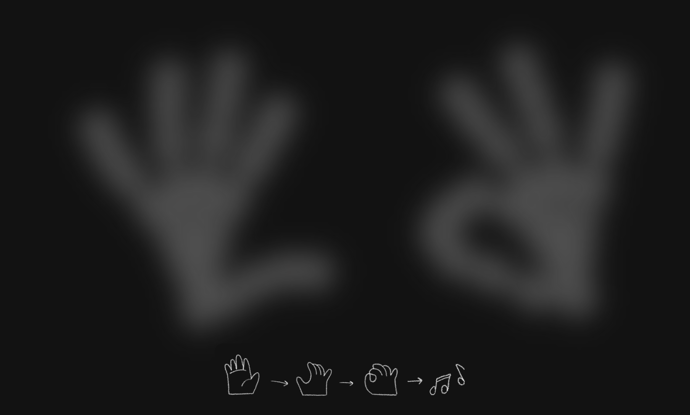

# Tiny Violin 🎻👌

Tiny Violin explores guesture based interaction by allowing users to enjoy creating music through device interaction.

Users can play a range of 8 notes by touching fingers to thumbs.

Play the Tiny Violin [here](https://tiny-violin.annabrisland.com/).

## How to Play
Built using TensorFlow.js and MediaPipe, the user can interact with the application by holding their hands up in front of their camera. The application will detect the user's hands and display a visual representation of the user's hands on the screen. The user can then play notes by touching their fingers to their thumbs.

## References
[Handpose](https://github.com/tensorflow/tfjs-models/tree/master/handpose) - A TensorFlow.js model that allows for hand tracking and gesture recognition.

[MediaPipe](https://github.com/google/mediapipe/blob/master/docs/solutions/hands.md) - Machine learning for high-fidelity hand and finger tracking solution.
